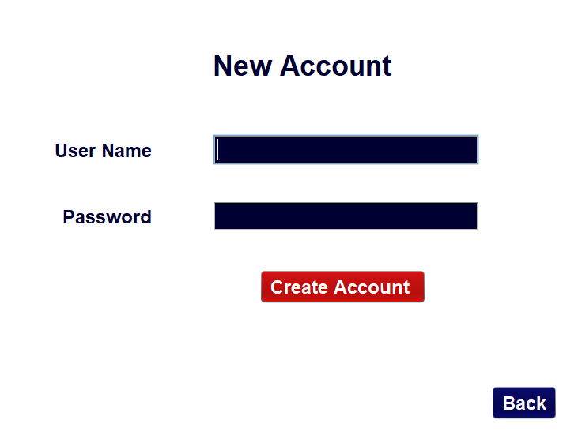
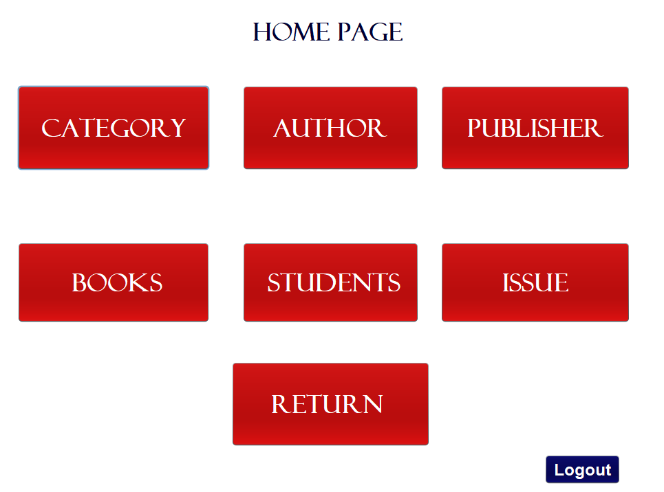
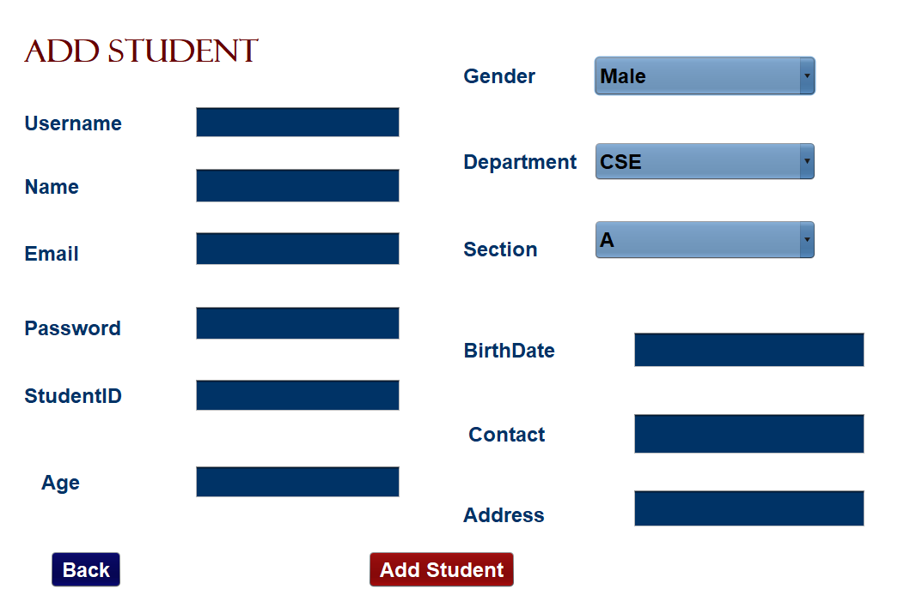
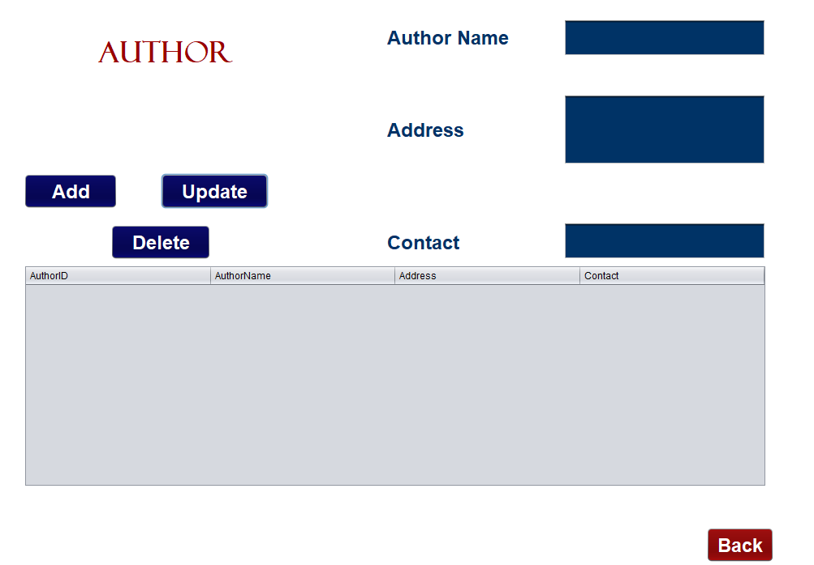
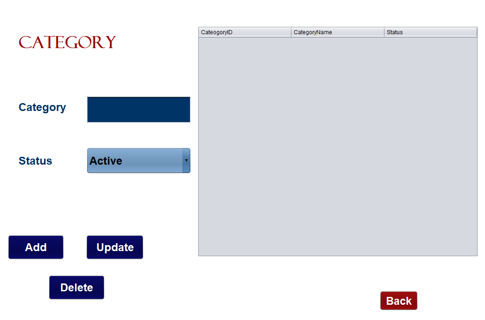
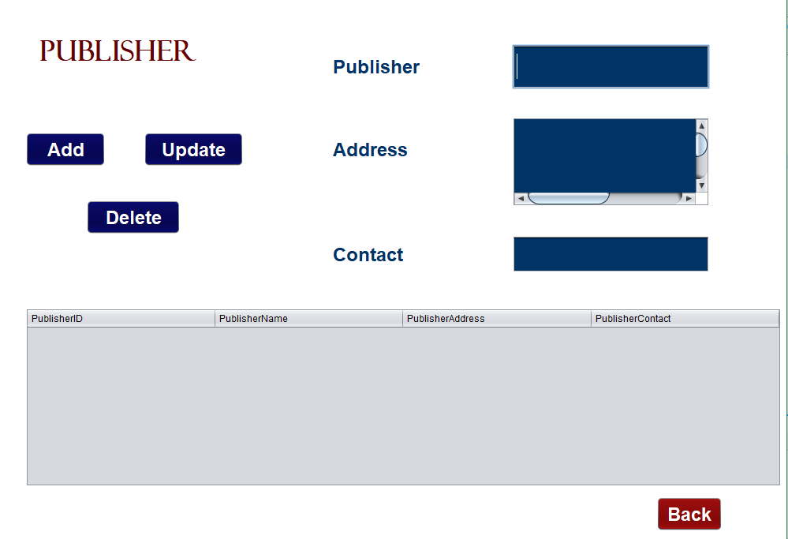
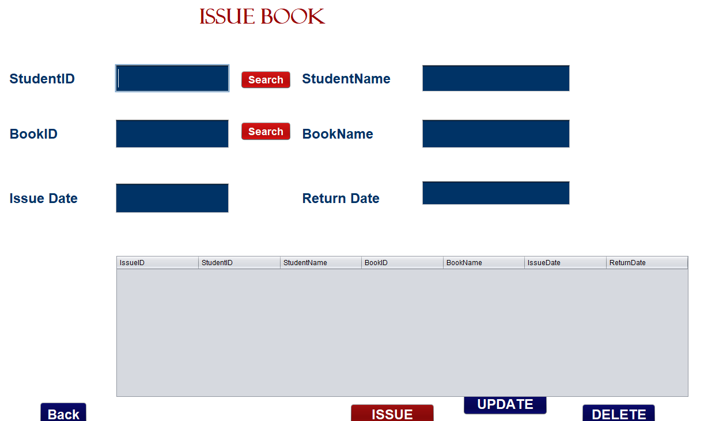
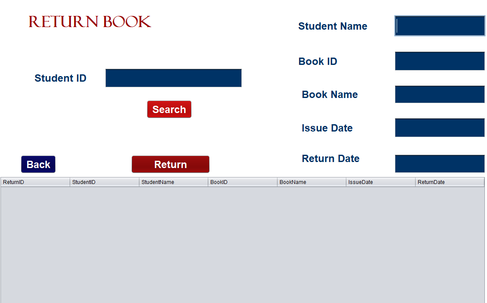

# Project Description  
MyLibrary is a library management system . Here a user can login and register to the system . They can recover their login password as well. Here is this system admin can add, update or delete students . Admin can add author , publisher , books and books category. User can issue their desired book according to their favourite author or category or publisher . They can also return books easily . 

## Features:
1. User Login and Registration System
2. Forgot Password
3. Home page
4. add/update/delete author
5. add/update/delete category
6. add/update/delete publisher
7. add/update/delete books
8. Issue book / Return book

### Languages: 
Java, Java Swing

### Databases:
MSSQL Server 2014 

### Tools and Technologies: 
Netbeans 8.0

## Project Demo :

      

     

     

     

     

